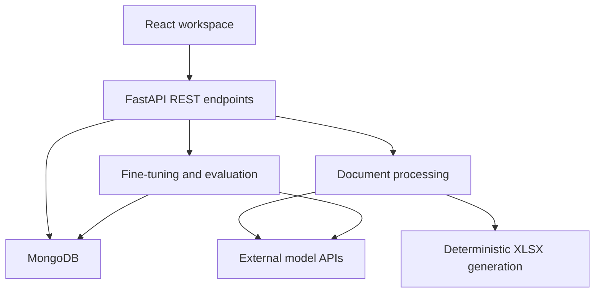

# Saffron AI Workflow Studio

**A full-stack workspace for document processing, human review, fine-tuning, and model evaluation.**

Saffron connects a React interface to Python services that turn business documents into structured records, reviewed training examples, and evaluated models. Its application domain is HR and vendor compliance; its engineering focus is making ML workflows usable through an end-to-end product.

The project combines a fine-tuning studio, AI-assisted document ingestion, deterministic spreadsheet generation, and operational dashboards.

## Core workflows

### Review data, fine-tune a model, and evaluate it

The fine-tuning studio gives platform administrators a single interface for:

- Creating datasets for three tasks: vendor-document extraction, register-schema extraction, and data normalization.
- Uploading documents to bootstrap examples, editing the resulting JSON, and approving or rejecting examples.
- Reserving held-out examples and previewing the training JSONL before submission.
- Creating OpenAI fine-tuning jobs, viewing status and events, and cancelling jobs.
- Comparing a base model with its fine-tuned version using field-level precision, recall, F1, and exact match.
- Reviewing outputs side by side and recording human judgments.

Approved held-out examples are excluded from training exports. Job state is persisted in MongoDB, and an APScheduler task refreshes in-flight jobs every two minutes. Evaluation limits concurrent examples to four and stores outputs, metrics, and token usage for inspection.

**Implementation:** [React studio](frontend/src/pages/FineTuneDashboard.js) · [API routes](backend/finetune/routes.py) · [Task definitions and metrics](backend/finetune/tasks.py)

### Extract and review business documents

The document pipeline accepts PDF, XLSX, and DOCX inputs and converts them into structured records for audit workflows.

- Routes model calls through configurable primary and fallback providers.
- Uses SHA-256 fingerprints to reuse extraction results for repeated uploads.
- Preserves extraction warnings and confidence information.
- Combines evidence from multiple documents before applying audit rules.
- Connects uploads, findings, manual overrides, and review actions to the web interface.

**Implementation:** [Extraction pipeline](backend/vendor_audit/ai_extraction.py) · [Provider router](backend/ai_providers/router.py) · [API client](frontend/src/services/api.js)

### Generate structured registers

Register Maker separates model-assisted interpretation from deterministic file generation:

1. Extract a schema from an uploaded register template.
2. Normalize source documents into structured records.
3. Map source fields to template columns and cache the mapping.
4. Generate an XLSX output with missing-field warnings.

The spreadsheet generator uses `openpyxl` and does not call an LLM. For XLSX templates, it works from the original workbook to retain formatting.

**Implementation:** [Register Maker UI](frontend/src/pages/RegisterMakerDashboard.js) · [Generator](backend/register_maker/generator.py)

## Architecture



The frontend provides dataset editors, job views, comparison screens, upload forms, and operational dashboards. FastAPI handles authentication, validation, orchestration, and persistence. Model integrations sit behind provider adapters for document-processing tasks; the fine-tuning lifecycle uses the OpenAI adapter directly.

## Engineering details

| Area | Implementation |
| --- | --- |
| Frontend | React 19, JavaScript, React Router, Tailwind CSS, Radix UI components, Axios |
| Backend | Python, FastAPI, Pydantic, asynchronous service handlers |
| Persistence | MongoDB with Motor |
| Authentication | JWT, bcrypt password hashing, platform-admin checks, module roles |
| Model integrations | Emergent, native OpenAI, and native Google provider adapters |
| Background work | APScheduler for audit scheduling and fine-tuning status polling |
| Document processing | pdfplumber, python-docx, openpyxl, ReportLab |
| Evaluation | Held-out comparisons, field-level metrics, exact match, human judgments |
| Diagnostics | Provider usage records, token counts, estimated costs, fallback outcomes |
| Tests | pytest unit tests and HTTP integration tests |

The surrounding application includes employee profiles, payroll and attendance workflows, contractor portals, vendor audits, and organization/module administration.

## Local development

### Prerequisites

- Python 3.11 or newer.
- Node.js and Yarn Classic 1.x.
- A running MongoDB instance.
- Provider credentials for the model operations you want to exercise.

The current backend imports `emergentintegrations` and includes an Emergent object-storage adapter. Native OpenAI and Google adapters do not remove those dependencies. Document operations using that storage adapter require `EMERGENT_LLM_KEY`; a fully independent local storage backend is not included.

### Backend

```bash
git clone https://github.com/rishi-more-2003/hrms-vndr-audit.git
cd hrms-vndr-audit/backend

python3 -m venv .venv
source .venv/bin/activate
python -m pip install -r requirements.txt
```

Create `backend/.env`:

```dotenv
MONGO_URL=mongodb://127.0.0.1:27017
DB_NAME=saffron_local
SECRET_KEY=replace_with_a_random_secret
CORS_ORIGINS=http://localhost:3000
PLATFORM_ADMIN_EMAIL=admin@example.test
PLATFORM_ADMIN_PASSWORD=replace_with_a_strong_local_password

# Configure only the integrations you intend to use.
EMERGENT_LLM_KEY=
OPENAI_API_KEY=
GOOGLE_API_KEY=
```

Replace the secret and password placeholders before starting. A random secret can be generated with:

```bash
python -c 'import secrets; print(secrets.token_urlsafe(48))'
```

Start the API from `backend/`:

```bash
uvicorn server:app --host 127.0.0.1 --port 8000 --reload
```

Interactive API documentation is available at [http://127.0.0.1:8000/docs](http://127.0.0.1:8000/docs).

On an empty database, startup creates the platform administrator configured above. Changing the password environment variable does **not** reset an existing account.

### Frontend

In a second terminal, enter `frontend/` from the repository root:

```bash
cd frontend
yarn install
```

Create `frontend/.env`:

```dotenv
REACT_APP_BACKEND_URL=http://127.0.0.1:8000
```

Then run:

```bash
yarn start
```

Open [http://localhost:3000](http://localhost:3000). Platform administrators sign in at `/platform-admin/login`; the fine-tuning studio is at `/platform-admin/finetune`.

To build the frontend:

```bash
yarn build
```

### Provider configuration

Document-processing tasks map to phases in [the provider router](backend/ai_providers/router.py). Each phase supports a primary provider/model and a fallback:

| Environment variables | Purpose |
| --- | --- |
| `AI_P1_PROVIDER`, `AI_P1_MODEL` | Extraction, normalization, and field mapping |
| `AI_P2_PROVIDER`, `AI_P2_MODEL` | Knowledge-query routing |
| `AI_P3_PROVIDER`, `AI_P3_MODEL` | Audit-report routing |
| `AI_P1_FALLBACK_PROVIDER`, `AI_P1_FALLBACK_MODEL` | Phase 1 fallback; the same pattern applies to P2 and P3 |

Provider names are `emergent`, `openai_native`, and `google_native`. Configure model identifiers available to the selected provider and account. The defaults use Emergent; setting a native-provider key alone does not switch routing.

Fine-tuning currently uses `OPENAI_API_KEY` directly. Training and model-backed evaluation require provider access and can incur usage charges. In-app cost estimates use static rate tables and approximate token counts.

## Tests

An isolated calculation suite can be run from `backend/`:

```bash
python -m pytest tests/test_payroll_calc.py -q
```

The broader suite covers API authorization, dataset and example operations, document validation, cache reuse, audit workflows, and provider fallback behavior.

Many integration tests expect a running API, seeded fixture accounts, or the original `/app` development layout. Some also invoke live model services. Configure those prerequisites before running the full suite; it is not currently a portable, entirely offline test command.

## Code guide

| Path | Responsibility |
| --- | --- |
| [frontend/src/pages/](frontend/src/pages/) | Application screens and ML workflow interfaces |
| [frontend/src/components/](frontend/src/components/) | Shared forms, shells, and UI components |
| [frontend/src/services/api.js](frontend/src/services/api.js) | Shared authenticated API client |
| [backend/server.py](backend/server.py) | FastAPI entry point, core routes, and startup tasks |
| [backend/finetune/](backend/finetune/) | Datasets, examples, job lifecycle, and evaluation |
| [backend/ai_providers/](backend/ai_providers/) | Model adapters, routing, fallback, and usage logging |
| [backend/vendor_audit/](backend/vendor_audit/) | Document extraction, validation, and audit logic |
| [backend/register_maker/](backend/register_maker/) | Template interpretation, normalization, and XLSX generation |
| [backend/tests/](backend/tests/) | Unit and integration tests |

## Current status

This is a development project with implemented workflows and remaining deployment work.

- **Implemented:** HRMS workflows, vendor audits, register generation, and the OpenAI fine-tuning studio.
- **Planned:** Internal Labour Audit and Consultancy Desk functionality. Their current interfaces are placeholders. Google fine-tuning is also not implemented.
- **Isolation:** Organization records and module roles exist, but tenant filtering is not complete across the application. The extraction cache currently supports cross-organization reuse.
- **Deployment:** Seeded demo accounts, fallback secrets, and permissive development settings need hardening before hosting an instance with real data.
- **Portability:** Some integrations and tests retain assumptions from the original Emergent development environment.

## Author

[Rishi More](https://github.com/rishi-more-2003) · [Portfolio](https://rishi-more-2003.github.io)
